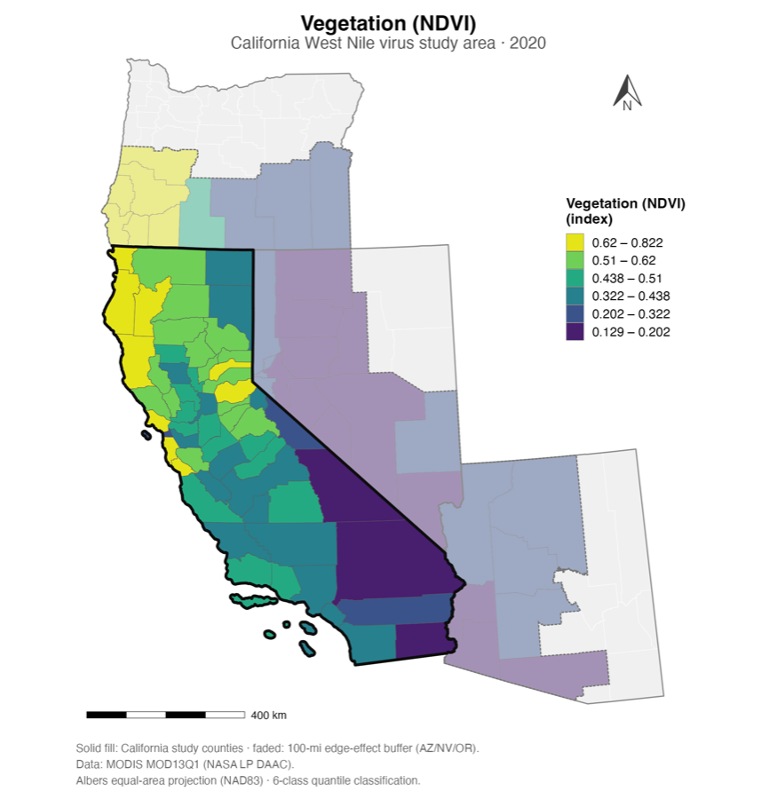
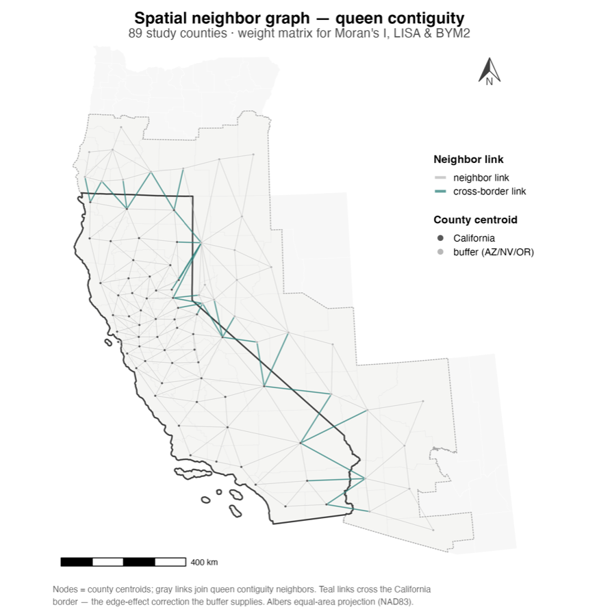
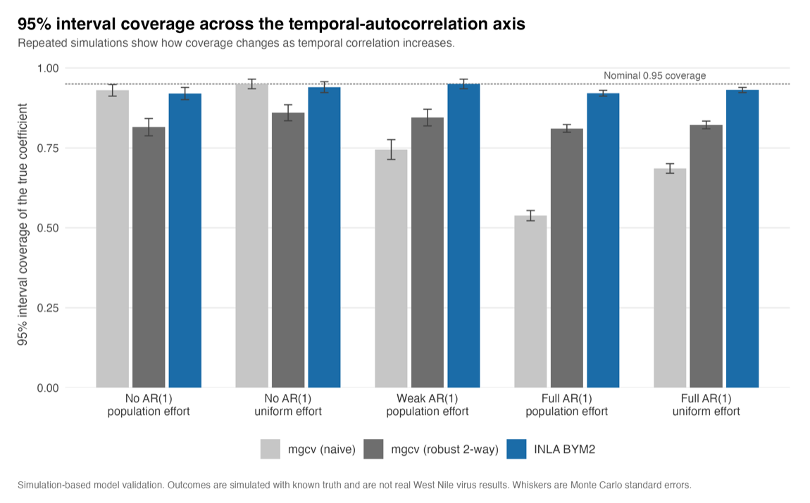

::: {.tags .project-tags}
[Spatial epidemiology]{.tag} [Bayesian modeling]{.tag} [Spatiotemporal]{.tag} [Surveillance data]{.tag} [Public health]{.tag} [R]{.tag}
:::

::: {.callout-note appearance="simple"}
**Status:** in progress; thesis expected 2027. The data pipeline and Bayesian
modeling framework are built and validated on simulated data. Fitting on the
California surveillance data is the next stage.
:::

## Problem

West Nile virus is monitored in California mostly through mosquito surveillance.
Agencies set traps, collect mosquitoes, sort them into pools by species and
location, and test those pools for the virus. That data is the earliest signal
we get for local WNV risk, but it's surveillance data, not a designed
experiment. Traps aren't placed at random, effort varies across counties and
years, and whether a pool tests positive depends both on how much virus is
circulating and on how hard and where anyone looked.

So the question I'm working on is this: across California, how do environmental
conditions and surveillance effort relate to WNV infection rate in mosquito
pools, once you account for the spatial and temporal structure in the data and
for uneven detection?

## Approach

The outcome is an infection rate in *Culex* mosquito pools: the probability that
a mosquito carries the virus, estimated from pooled test results instead of
treating each pool as a plain positive or negative. The analytic unit is the
county-month, over a multi-year period covering California and a buffer into
neighboring states.

Surveillance effort and detection are treated as part of how the data comes to
exist, not as a nuisance to drop. Effort goes into the model, the estimand is
defined up front, and spatial confounding is handled directly.

The work moves in stages:

1. **Exploratory spatial data analysis (ESDA).** Describe the spatial and
   temporal pattern, test for clustering, and locate hot spots before fitting
   anything.
2. **Covariate assembly.** Build a reproducible environmental data warehouse on
   the county-month grid.
3. **Hierarchical spatiotemporal modeling.** Fit Bayesian models that share
   information across space and time and separate signal from surveillance
   artifact.

<figure class="fig">

<figcaption>One layer of the environmental covariate warehouse: MODIS vegetation (NDVI) across the California study area and its 100-mile neighbor-state buffer, 2020. Everything is assembled on a county-by-month grid.</figcaption>
</figure>

## Methods and tools

- **Outcome.** Pooled-prevalence infection rate for WNV in *Culex* vectors,
  estimated from mosquito-pool test data with pool sizes accounted for.
- **Structure.** County-month observations across California, plus a buffer of
  neighboring-state counties, over a multi-year period.
- **Environmental covariates.** Vegetation indices (NDVI/EVI), land surface
  temperature, climate and drought measures, land cover, and irrigation, among
  others, assembled and validated on the analytic grid.
- **Exploratory spatial analysis.** Global and local autocorrelation
  (Moran's I, Getis-Ord Gi\*), emerging hot-spot analysis, and space-time
  description.
- **Modeling.** Bayesian hierarchical spatiotemporal models: a conditional
  autoregressive (BYM2-type) spatial structure with temporal terms and
  distributed-lag climate effects, fit with established spatial-modeling engines.
  A spatial-confounding adjustment ("spatial+") and with/without-spatial
  sensitivity analyses are part of the plan.
- **Stack.** R for the analysis and modeling, and a SQL-backed ETL pipeline for
  the data warehouse. Version-controlled and reproducible throughout.

<figure class="fig">

<figcaption>The queen-contiguity neighbor graph over the 89 study counties: the spatial weight matrix behind Moran's I, LISA, and the BYM2 model. Teal links cross the California border, where the neighbor-state buffer corrects edge effects.</figcaption>
</figure>

## Status

The pipeline and modeling framework are built and stress-tested on simulated
data: feasibility checks, pathology tests, and a model-specification study to
choose the analytic model before fitting the real outcome. The simulation study
takes real public covariate structure, simulates outcomes with a known effect,
and checks whether each candidate model's 95% intervals cover that effect at the
stated rate, across scenarios that vary temporal autocorrelation, overdispersion,
and positivity.

<figure class="fig">

<figcaption>Simulation-based model validation: 95% interval coverage for three specifications as temporal autocorrelation increases. Naive models collapse well below nominal coverage; the BYM2 spatiotemporal model holds near 0.95. Outcomes are simulated with a known truth, not real WNV data.</figcaption>
</figure>

Leaving out seasonal and month-to-month temporal structure badly under-covers
the uncertainty intervals, while the BYM2 spatiotemporal specification stays near
nominal. The point estimates alone don't reveal the problem. Fitting the model on
the California surveillance data is the next stage.
