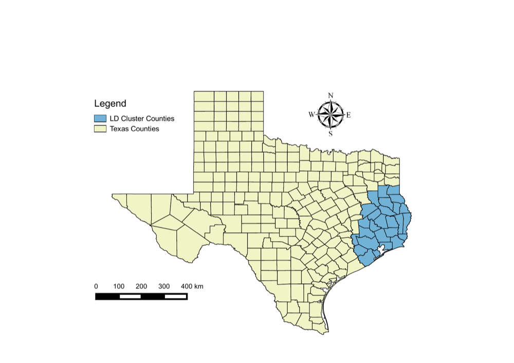

Peer-reviewed articles, preprints, the thesis, and earlier work. In-progress
items are noted.

[ORCID [0009-0005-8235-6047](https://orcid.org/0009-0005-8235-6047) · Google Scholar [profile](https://scholar.google.com/citations?user=NAcxI4IAAAAJ)]{.pub-meta}

## Peer-reviewed

::: {.pub-list}

::: {.pub}
[The impact of COVID-19 on globalization]{.pub-title}

[Shrestha N, Shad MY, Ulvi O, Khan MH, Karamehic-Muratovic A, Nguyen U-SDT, Baghbanzadeh M, **Wardrup R**, Aghamohammadi N, Cervantes D, Nahiduzzaman KM, Zaki RA, Haque U]{.pub-authors}

[*One Health* 11:100180 · 2020]{.pub-venue}

[Contributed quantitative analysis of pandemic spread, mobility, and economic disruption. Built a country-level COVID-19 vulnerability index (TOPSIS with model-derived weights).]{.pub-desc}

[[DOI](https://doi.org/10.1016/j.onehlt.2020.100180) [Full write-up →](projects/covid-globalization.qmd)]{.pub-links}
:::

:::

## Preprints

::: {.pub-list}

::: {.pub}
[Spatial patterns of COVID-19 mortality: examining socioeconomic determinants in U.S. counties using cluster analysis]{.pub-title}

[Wardrup RR · sole-authored]{.pub-authors}

[medRxiv · 2024]{.pub-venue}

[Spatial-epidemiology study across 3,000+ U.S. counties: SaTScan cluster detection to locate significant mortality trends, and spatial lag and error regression on socioeconomic determinants (race, income inequality, uninsured rate), accounting for spatial autocorrelation and multicollinearity. The spatial lag model fit best.]{.pub-desc}

[[DOI](https://www.medrxiv.org/content/10.1101/2024.10.30.24316443v1) [Full write-up →](projects/covid-mortality.qmd)]{.pub-links}
:::

:::

## Thesis

::: {.pub-list}

::: {.pub}
[Bayesian spatiotemporal modeling of West Nile virus in California: environmental drivers, surveillance effort, and mosquito-pool infection]{.pub-title}

[MPH thesis · University of Memphis]{.pub-venue}

[In progress; expected 2027.]{.pub-desc}

[[Project page →](projects/wnv-thesis.qmd)]{.pub-links}
:::

:::

## Unpublished manuscripts

::: {.pub-list}

::: {.pub}
[Spatio-temporal clustering of Lyme disease in Texas, 2000–2014]{.pub-title}

[Wardrup RR · sole-authored]{.pub-authors}

[Unpublished manuscript · 2015]{.pub-venue}

[A study across all 254 Texas counties using SaTScan space-time cluster detection and Kendall's rank correlation to test association with deciduous-forest habitat; detected one significant space-time cluster in southeastern Texas and found no significant forest-habitat association. Early independent research; submitted but not published.]{.pub-desc}
:::

:::

<figure class="fig fig-sm">

<figcaption>Detected Lyme disease space–time cluster (blue), southeastern Texas, 2000–2014, from the SaTScan analysis above.</figcaption>
</figure>
